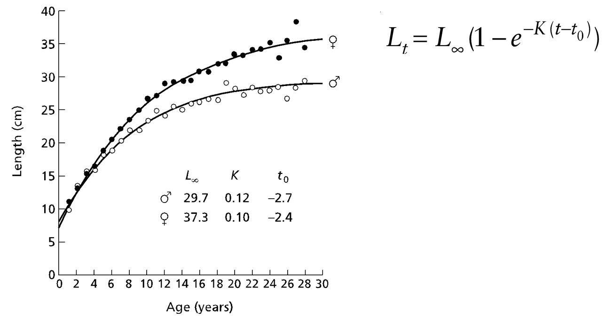

```{r setup, include=FALSE}
knitr::opts_chunk$set(echo = TRUE)
lab_path = dirname(rstudioapi::getSourceEditorContext()$path)
knitr::opts_knit$set(root.dir = lab_path)
getwd()
set.seed(9999)
require(FSAdata) 
require(FSA) # you may need to install this package
require(tidyverse)
require(rfishbase)
```
**Plot like you are turning in a professional fisheries report**
1) Use these `FSA` datasets to visualize life history patterns and growth curves. Label your axes.

`HerringBWE` Stock and recruitment data for Blackwater Estuary Herring (Clupea harengus), 1962-1997 spawning years.
- plot `spawning stock biomass` vs. `year`
- fit a linear regression and label the R-squared value
- plot `spawning stock biomass` per `recruit` vs `year`
- plot residuals

`BlackDrum2001` Biological data (lengths, weights, ages from otoliths, and sex) for Black Drum (Pogonias cromis) from Virginia waters of the Atlantic Ocean, 2001. (TL mm). *HINT* you might need to remove NA values when fitting regression models.

- plot `Weight` (kg) vs. `Length` (mm)
- transform the data with `log` 
- model their linear and non-linear relationship (**NOTE** for non-linear, use `nls` and the weight at length equation)
- show both fitted plots next to each other

`Bonito` Ages and length (inches) measurements of Australian Bonito (Sarda australis). 
- plot `Length` vs `Age`, add `Sex` as a categorical variable
- fit VBGF curves to both sexes on the same plot (picture for example)

```{r pressure, echo=FALSE, fig.cap="A caption", out.width = '100%'}

```

## Question
Using VBGF, what is the predicted length (inches) of a 1.5 year old *female* Bonito?
$$
L(a) = L_{inf}(1-e^{(-k(a-t_0))})
$$

2) Report the mortality rate of blue sharks using the two methods from `Then.etal.2014` and `Dulvy.etal.2014`
```{r}
# age at maturation
agemat = 6.5
# lifespan
lifespan = 12
```

3) Growth Modeling
- plot an exponential growth model for a stock with `initial population size of 1500`, an `annual death rate of 0.07`, and an `annual harvest (catch) of 100` individuals. Compare the effects of different `birth rates b=0.15, b=0.2, and b=0.25` on the population trajectory. Project the population growth over `30 years`.  


